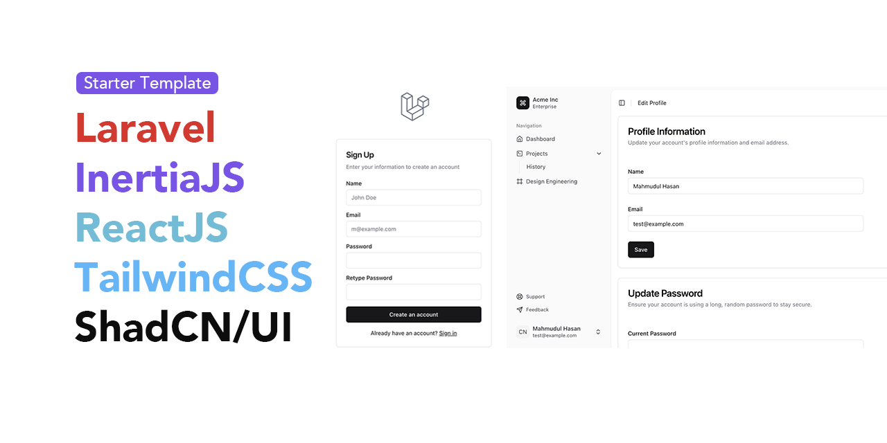

# Laravel + React Inertia + shadcn/ui Admin Panel Starter Kit

A modern, type-safe admin panel starter kit built with Laravel 11, React, TypeScript, and shadcn/ui. Features a beautiful UI with dark mode support and full authentication system.

## ✨ Features

- 🛡️ **Type-Safe Development** with TypeScript
- 🎨 **Modern UI Components** using shadcn/ui
- 🌓 **Dark Mode Support** with system theme detection
- 🔒 **Full Authentication System**
- 📱 **Responsive Design** for all devices
- 🚀 **Fast Development** with Vite
- 🔄 **SPA-like Experience** with Inertia.js

## 🛠️ Tech Stack

- [Laravel 11](https://laravel.com/docs/11.x)
- [React 18](https://react.dev)
- [TypeScript](https://www.typescriptlang.org/)
- [Inertia.js](https://inertiajs.com/)
- [shadcn/ui](https://ui.shadcn.com)
- [Tailwind CSS](https://tailwindcss.com)
- [Lucide Icons](https://lucide.dev)

## 📋 Requirements

- PHP >= 8.2
- Node.js >= 18
- Composer
- MySQL/PostgreSQL

## 🚀 Installation

1. Clone the repository:

2. Run `composer install`

3. Run `npm install`

4. Run `php artisan migrate`

5. Run `php artisan serve`

6. Run `npm run dev`